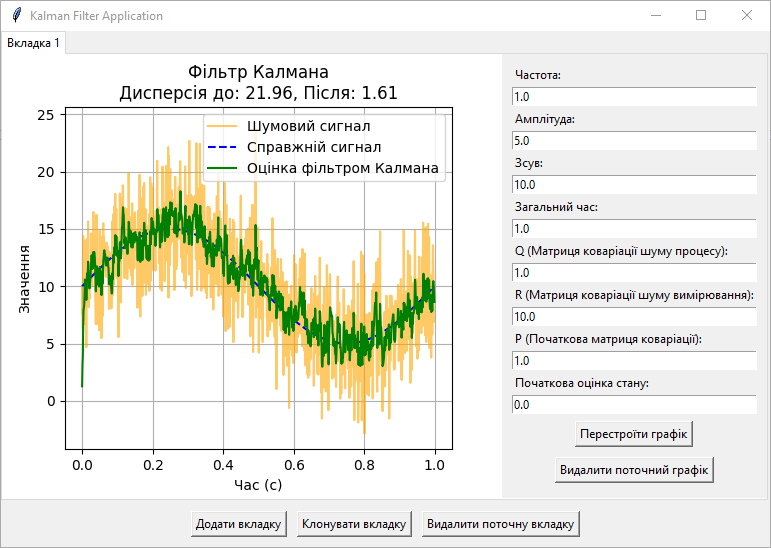
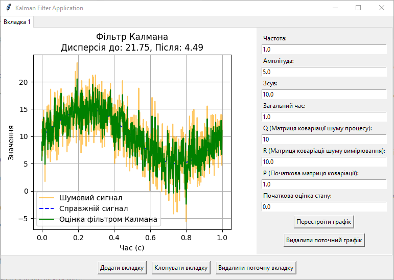
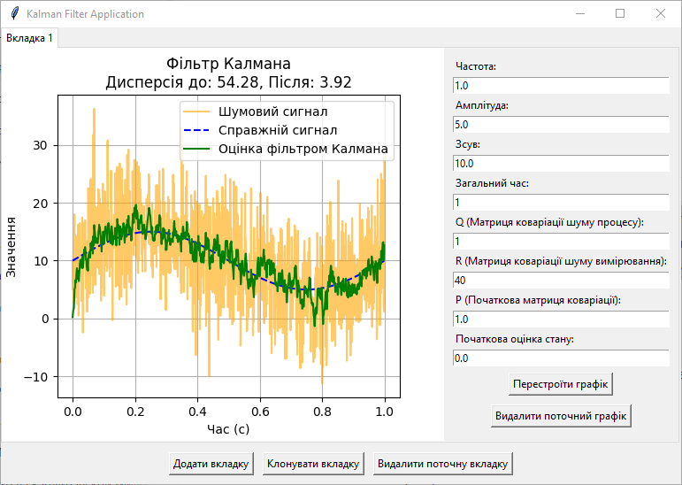
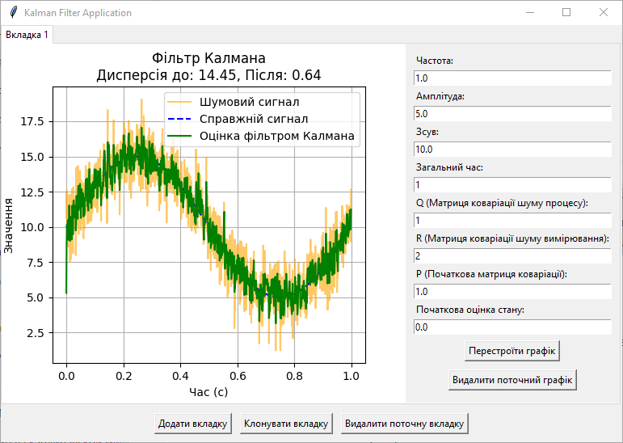
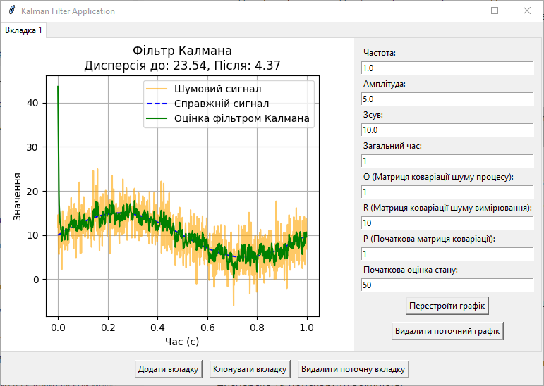
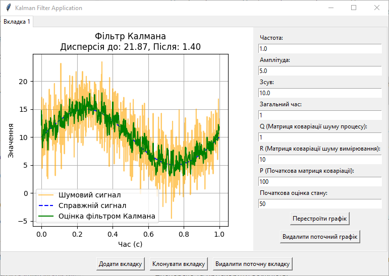
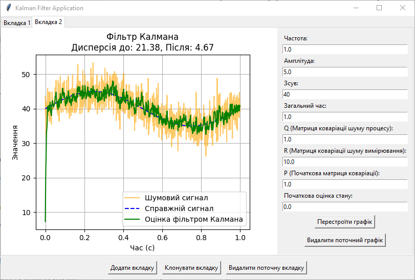
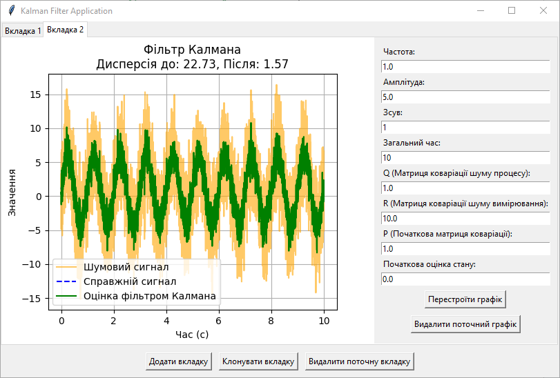

## Титул
## Дослідження фільтра Калмана
## Виконав студент: Прокопенко Євгеній ІПЗ-4.04
## з дисципліни: **"Розробка та програмування координатних систем"**

## Мета роботи

Ознайомитися з роботою фільтра Калмана та принципами його застосування, вивчити вплив різних параметрів фільтра на результати згладжування сигналу та навчитися аналізувати результати фільтрації, враховуючи значення дисперсії шуму до та після фільтрації.

## Завдання

1. **Ініціалізація коду:**

— Використайте код, що наданий у розділі "Теоретичні відомості", як базовий шаблон;

```python

import numpy as np
import matplotlib.pyplot as plt

class KalmanFilter:
    def __init__(self, F, H, Q, R, P, x):
        self.F = F  # State transition matrix
        self.H = H  # Measurement matrix
        self.Q = Q  # Process noise covariance
        self.R = R  # Measurement noise covariance
        self.P = P  # Initial estimation error covariance
        self.x = x  # Initial state

    def predict(self):
        # Predict the state and error covariance
        self.x = np.dot(self.F, self.x)
        self.P = np.dot(self.F, np.dot(self.P, self.F.T)) + self.Q
        return self.x

    def update(self, z):
        # Calculate Kalman Gain
        K = np.dot(self.P, self.H.T) / (np.dot(self.H, np.dot(self.P, self.H.T)) + self.R)

        # Update the estimate via measurement z
        self.x = self.x + K * (z - np.dot(self.H, self.x))

        # Update the error covariance
        self.P = (np.eye(len(self.P)) - K * self.H) @ self.P

        return self.x

# === Signal Parameters ===
frequency = 1  # Frequency of the sine wave in Hz
amplitude = 5  # Amplitude of the sine wave
offset = 10  # Offset of the sine wave
sampling_interval = 0.001  # Sampling interval in seconds (1 ms)
total_time = 1  # Total duration in seconds (1 second)

# === Noise Parameters ===
noise_variance = 16  # Variance of the Gaussian noise
noise_std_dev = np.sqrt(noise_variance)  # Calculate the standard deviation from the variance

# === Filter Parameters ===
F = np.array([[1]])  # State transition matrix
H = np.array([[1]])  # Measurement matrix

Q = np.array([[1]])  # Process noise covariance
R = np.array([[10]])  # Measurement noise covariance

P = np.array([[1]])  # Initial estimation error covariance
x = np.array([[0]])  # Initial state estimate

# Create Kalman filter instance
kf = KalmanFilter(F, H, Q, R, P, x)

# === Signal Generation ===
time_steps = np.arange(0, total_time, sampling_interval)  # Generate time steps from 0 to total_time with step size of sampling_interval
true_signal = offset + amplitude * np.sin(2 * np.pi * frequency * time_steps)  # Generate sine wave based on parameters
noisy_signal = [val + np.random.normal(0, noise_std_dev) for val in true_signal]  # Add Gaussian noise with calculated standard deviation

# === Apply Kalman Filter ===
kalman_estimates = []

for measurement in noisy_signal:
    kf.predict()  # Predict next state
    estimate = kf.update(measurement)  # Update with noisy measurement
    kalman_estimates.append(estimate[0][0])  # Store the filtered result

# === Calculate Variance Before and After Filtering ===
noise_variance_before = np.var(noisy_signal - true_signal)  # Variance of noise in the original signal
noise_variance_after = np.var(kalman_estimates - true_signal)  # Variance of noise after Kalman filtering

# Display variances
print(f"Noise Variance Before Filtering: {noise_variance_before:.2f}")
print(f"Noise Variance After Filtering: {noise_variance_after:.2f}")

# === Plot the Results ===
plt.figure(figsize=(12, 6))
plt.plot(time_steps, noisy_signal, label='Noisy Signal', color='orange', linestyle='-', alpha=0.6)
plt.plot(time_steps, true_signal, label='True Signal (Sine Wave)', linestyle='--', color='blue')
plt.plot(time_steps, kalman_estimates, label='Kalman Filter Estimate', color='green')
plt.xlabel('Time (s)')
plt.ylabel('Value')
plt.title('Kalman Filter Applied to a Noisy Sinusoidal Wave')
plt.legend()
plt.grid()
plt.show()

```

— Переконайтеся, що всі параметри фільтра Калмана (F, H, Q, R, P, x) задані правильно та відповідають початковому варіанту.


2. **Дослідження впливу параметрів.** Послідовно змінюйте значення кожного з наступних параметрів фільтра Калмана:

- **Матриця коваріації шуму процесу** (Q): збільшуйте та зменшуйте значення, аналізуйте, як це впливає на передбачення;
- **Матриця коваріації шуму вимірювання** (R): змініть цей параметр, щоб побачити, як фільтр реагує на зміну довіри до вимірювань;
- **Початкова матриця коваріації** (P): експериментуйте з різними початковими невпевненостями щодо стану;
- **Початкова оцінка стану** (Initial state estimate): спробуйте різні початкові значення та простежте, як це впливає на збіжність фільтра;
- **Постійна складова сигналу** (offset): змініть зсув сигналу, щоб оцінити, наскільки фільтр адаптується до зміщеного сигналу;
- **Загальний час моделювання** (total_time): для фільтрацій із дуже інерційними параметрами, змініть загальний час симуляції, щоб переконатися, що фільтр встигає "налаштуватися" та стабілізувати свої результати.

3. **Порівняння результатів.** Для кожної комбінації параметрів:

- Розрахуйте **дисперсію шуму до фільтрації** та **після фільтрації**;
- Створіть **графік**, що показує результати фільтрації у порівнянні з реальним сигналом та шумним сигналом;
- Зробіть скріншоти кожного **графіка** та додайте їх у звіт.

4. **Аналіз та висновки:**

- Зафіксуйте значення дисперсії шуму до і після фільтрації.;
- Для кожного випадку фільтрації прокоментуйте результати;
- Поясніть, як зміна конкретного параметра вплинула на передбачення, корекцію стану та зміну дисперсії;
- Сформулюйте загальні висновки щодо поведінки фільтра Калмана при різних комбінаціях параметрів.

## Розробка проєкта дослідження фільтра Калмана

#### 1. Технології

Для реалізації проєкту з використання фільтра Калмана для обробки даних та побудови графіків було обрано мову програмування Python. Цей вибір обумовлений кількома вагомими причинами:

Легкість візуалізації даних: Python має потужні інструменти для побудови графіків, такі як Matplotlib. Завдяки цій бібліотеці, я зміг створити графіки для наочної демонстрації результатів фільтрації, включаючи справжній сигнал, шумовий сигнал та оцінки, отримані фільтром Калмана. Це дозволяє легко відстежувати зміни та аналізувати точність фільтрації.

Потужні бібліотеки для наукових обчислень: Python підтримує роботу з великими масивами даних та матрицями завдяки бібліотекам, таким як NumPy. У проєкті фільтра Калмана я використав NumPy для ефективного виконання обчислень, включаючи множення матриць і обробку шуму, що є важливим для досягнення високої продуктивності та точності.

Гнучкість у реалізації інтерфейсу користувача: Для створення графічного інтерфейсу було використано бібліотеку Tkinter, яка дозволяє легко створювати елементи управління, такі як кнопки та вкладки. Це забезпечує зручність у користуванні додатком, дозволяючи взаємодіяти з графіками та налаштуваннями фільтра в реальному часі.

#### 2. Фільтр Калмана

У файлі `src/KalmanFilter.py` був створений клас `KalmanFilter`.

клас `KalmanFilter` реалізує алгоритм фільтра Калмана, який дозволяє оцінювати стан системи на основі шумових даних.

**Атрибути класу:**

- `F`: Матриця переходу стану, що описує, як стан змінюється між моментами часу.
- `H`: Матриця спостереження, яка пов’язує стан із вимірюваннями.
- `Q`: Коваріаційна матриця процесного шуму, яка враховує невизначеність змін стану.
- `R`: Коваріаційна матриця шуму вимірювання, яка представляє невизначеність вимірювань.
- `P`: Коваріаційна матриця початкової оцінки стану, яка показує, наскільки ми впевнені в поточному стані.
- `x`: Початкова оцінка стану, що буде уточнюватись фільтром.

**Методи класу:**
- `predict`: Виконує передбачення нового стану та оновлює оцінку стану `x` і матрицю коваріації помилки `P`. Це крок передбачення, який використовує інформацію про попередній стан для оцінки поточного стану до надходження нових даних.

- `update`: Оновлює оцінку стану на основі нового вимірювання `z`. Функція обчислює коефіцієнт Калмана `K`, що визначає, наскільки сильно вимірювання впливають на оцінку стану, і використовує його для оновлення стану `x` та матриці помилки `P`.

#### 3. Скрипт будування графіків використання фільтру Калмана

Файл `src/main.py` відповідає за побудову графіків, які демонструють роботу фільтру Калмана у вигляді додатку на основі Tkinter з інтерфейсом користувача. Додаток дозволяє користувачеві взаємодіяти з графіками, створювати нові вкладки, клонувати існуючі та змінювати параметри фільтру.

**Основні компоненти:**

**KalmanApp**: Головний клас додатку, який відповідає за створення інтерфейсу, управління вкладками та виклик функцій для побудови графіків.

**Інтерфейс користувача**: Використано бібліотеку `Tkinter` для створення графічного інтерфейсу, де користувач може змінювати параметри фільтру, такі як частота, амплітуда, загальний час, матриці коваріацій `Q` і `R`, а також початковий стан і матриця коваріації `P`.

**Вкладки**: Додаток підтримує можливість додавати, клонувати та видаляти вкладки, кожна з яких містить окремий графік фільтру Калмана з власними параметрами.

**Ключові методи:**

- `create_new_tab`: Створює нову вкладку, додає поле з графіком, панель управління параметрами, де користувач може вводити значення для `частоти`, `амплітуди`, `зсуву`, `Q`, `R`, `P` та `початкового стану`;

- `clone_current_tab`: Клонує поточну вкладку з усіма налаштуваннями параметрів, що дозволяє швидко створити копію вкладки;

- `redraw_graph`: На основі введених параметрів здійснює побудову графіка, застосовуючи `фільтр Калмана` для очищення шумового сигналу та порівнює `дисперсії` до та після фільтрування;

- `clear_graph`: Очищає поточний графік, видаляючи всі дані;

- `remove_current_tab`: Видаляє поточну вкладку.

**Загальний процес:**

Користувач задає параметри, за якими генерується сигнал та фільтрується шум. Фільтр Калмана дозволяє очистити сигнал від шуму, що ілюструється графічно. У результаті виводиться графік, на якому видно шумовий сигнал, початковий, отриманий та оцінений фільтром.

#### 4. Проведення аналізу

Виконаємо запуск файлу тестування: 

> python main.py

**Результат:**



Як можна побачити з рисунку, програма відкрила вікно з вкладкою графіка. Програма дозволяє створювати різні вкладки для перегляду та аналізу графіків, також присутня можливість переносу встановлених параметрів до нової вкладки та видалення поточної вкладки.

До будування графіку приймаються настпуні значення:

- Частота;
- Амплітуда;
- Зсув;
- Загальнйи час;
- Значення матриці коваріації шуму процесу — `Q`;
- Значення матриці коваріації шуму вимірювання — `R`;
- Значення початкової матриці коваріації — `P`;
- Початкова оцінка стану.

У кожній вкладці можна перестроїти графік до нових значень та видалити графік до нового будування.

Виконаємо аналіз графіка при зміні `матриці коваріації шуму процесу (Q)`:

Матриця коваріації шуму процесу враховує невизначеність у моделі процесу. Показує, наскільки сильно очікується відхилення передбаченого стану через випадкові зміни.

Збільшимо `Q` до `10`:

Це вказує фільтру, що процес є більш шумним і мінливим. Фільтр більш агресивно адаптується до нових вимірювань, оскільки довіряє їм більше, ніж своїм передбаченням. Це призводить до більшої дисперсії з `1.61` до `4.49`, оскільки фільтр спробує швидше реагувати на зміни.

Графік стає менш схожим за справжній сигнал та уподолюється до шумового сигналу.

Оскільки процес є стаблільним, то слід використовувати менші значення `Q`.



Виконаємо аналіз графіка при зміні `матриці коваріації шуму вимірювання (R)`:

Матриця коваріації шуму вимірювання визначає точність вимірювань, при більшому значенні вказується менший рівень довіри до сенсорів. 

Зменшимо довіру до сенсорів, збільшимо `R` до `40`:

Фільтр буде менше покладатися на дані з вимірювань і більше на свої передбачення, що збільшує стабільність, але може спричинити повільну реакцію на нові вимірювання. Це призвело до більшої дисперсії з `1.61` до `3.92` та зрозтанню амплітуди графіку, через меншу довіру до отримануваного сигналу.



Збільшимо довіру до сенсорів, зменшимо `R` до `2`:

Через високу точність сенсорів та збільшення довіри до них, значення дисперсії впало з `1.61` до `0.64`. А графік оцінки фільтром Калмана став більш наближеним до реального сигналу.



Виконаємо аналіз графіка при зміні `початкової матриці коваріації (P)`:

Матриця початкової коваріації описує початкову невпевненість у стані, вказує довіру до початкових данних.

Збільшимо `P` до `50`:

Фільтр сприймає початковий стан як менш точний, що змушує його активніше коригуватися на початкових етапах. Це викликає більшу дисперсію, оскільки фільтр стає більш чутливий до вимірювань на початку. Це призводить до більшої дисперсії оцінки фільтру Калмана з `1.61` до `4.37` при вказаній початковій оцінці стану `50` та довірі у `1`.

Початок графіку стає менш схожим за справжній сигнал.



Після збільшення `P` впадає довіра до початкового стану, початок графіку стає більшим реальним та падає значення дисперсії:



Початкова оцінка стану впливає на початкову точку, з якої фільтр починає роботу. Якщо ця оцінка сильно відрізняється від реального стану, фільтр витратить більше часу на налаштування і досягнення точного результату. Правильний вибір початкового стану може зменшити дисперсію та прискорити збіжність.

Виконаємо аналіз графіка при зміні `зсуву сигналу`:

Збільшимо `зсув` до `40`:

Сигнал зміщено, фільтр адаптується до цього зміщення, але для цього потрібен час. Збільшення зсуву без коригування фільтра спричиняє зростання дисперсії до `4.67`, оскільки фільтр намагається пристосуватися до змін у базовій лінії сигналу.

Початок графіку стає менш схожим за справжній сигнал.



Виконаємо аналіз графіка при зміні `загального часу моделювання`:

Збільшимо `загальний час моделювання` до 10:

Це дозволяє фільтру більше часу на стабілізацію своїх результатів, що стабілізує рівень дисперсії до `1.57`.



## Висновок

У ході виконання цієї роботи я підтвердив теоретичний матеріал з теми дослідження фільтра Калмана, а саме: ознайомився з роботою фільтра Калмана та принципами його застосування, вивчив вплив різних параметрів фільтра на результати згладжування сигналу та навчився аналізувати результати фільтрації, враховуючи значення дисперсії шуму до та після фільтрації.

Фільтр Калмана є потужним інструментом для оцінювання станів систем у присутності шумів та невизначеностей, що робить його надзвичайно корисним у багатьох сферах, таких як робототехніка, автомобільна навігація та обробка сигналів. Завдяки своїй здатності поєднувати вимірювання з різних джерел і зменшувати вплив шуму, фільтр Калмана дозволяє отримувати більш точні та стабільні оцінки стану об'єкта. Це особливо важливо у випадках, коли дані, отримані від сенсорів, можуть бути спотворені або неповними. Застосування фільтра Калмана в реальному часі дозволяє системам адаптуватися до змін у навколишньому середовищі, що підвищує їхню ефективність та надійність. Таким чином, фільтр Калмана значно поліпшує точність оцінки стану системи, що робить його невід'ємною частиною сучасних технологій автоматизації та контролю.

Отриманні знання та навички являють собою основу при розробці програмних систем та при вивчені дисципліни `Розробка та програмування координатних систем` в цілому.